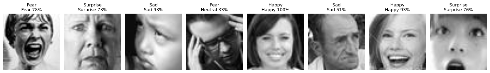
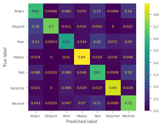
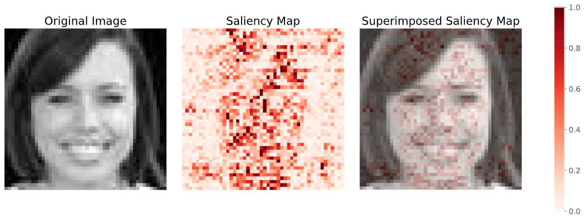

# Facial Expression Recognition [LoopAI Competition]
Facial expression recognition (FER) is an important task to improve cross-domain human-computer interaction systems. Given the dataset provided by the competition organizer, we modified and applied the current state-of-the-art convolutional neural networks (CNNs) to the FER task. Our best single model obtain a 69.1\% in the validation accuracy, while our ensemble model achieves 71.1\%. Additionally, we investigated the quality of the models and the limits of the given dataset. 



Read the **report.pdf** for more details on the work.

## Run the code
Install first the dependencies, then
```
python3 webcam.py
```
This will activate the webcam and uses a simple Haar Cascade model from OpenCV to detect the face from the video frames. The detected region will be fed to the FER model for emotion classification.

## Evaluation
Results of the experiments on the dataset FER2013 and the competition dataset FERLoopAI.

| Architecture | Parameters | FER2013 Valid Acc. | FERLoopAI Valid Acc. |
|---------------------|---------------------|-----------------------------|-------------------------------|
| Human (Base)        | -                   | 65                    | -                             |
| VGGNet*             | 4.7 M               | 72.6                        | **69.1**                          |
| ResNet18*           | 5.1 M               | 72.2                        | 67.7                          |
| DenseNet121*        | 3.9 M               | 70.6                        | 67.2                          |
| ViT                 | 85.2 M              | 64.2                        | 63.8                          |
| MobileNetV3         | 5.4 M               | -                           | 61.8                          |
| EfficientNet-B3     | 10.7 M              | -                           | 66.6                          |
| Ensemble5           | 115 M               | -                           | **71.1**                 |


<!-- ## Confusion Matrix
Confusion matrix from the Ensemble5 model, which is the ensemble of the best 5 models (excluding MobileNetV3) and averaging their output to predict the class.

 -->


<!-- ## Saliency Map
In order to analyze the inside of a deep convolutional neural network, we applied the saliency map technique. From the Figure we can see that the model is correctly laying its attention on many relevant part of the face: cheeks, nose, mouth, and forehead. 

 -->
